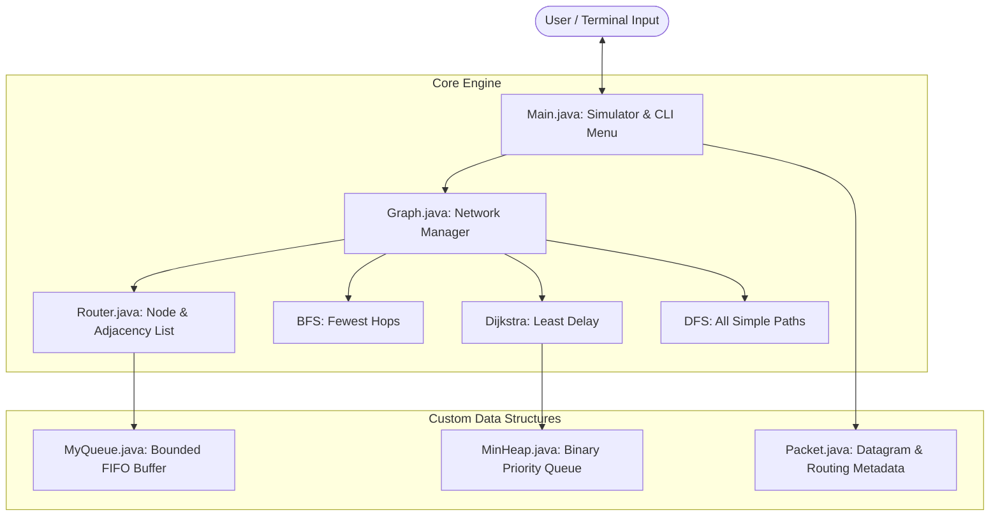
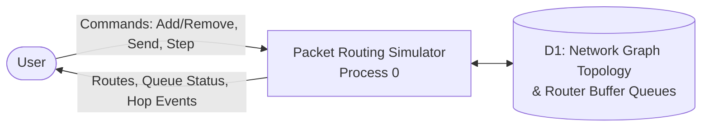
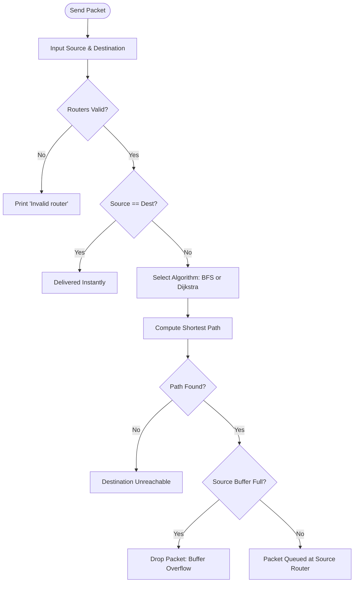
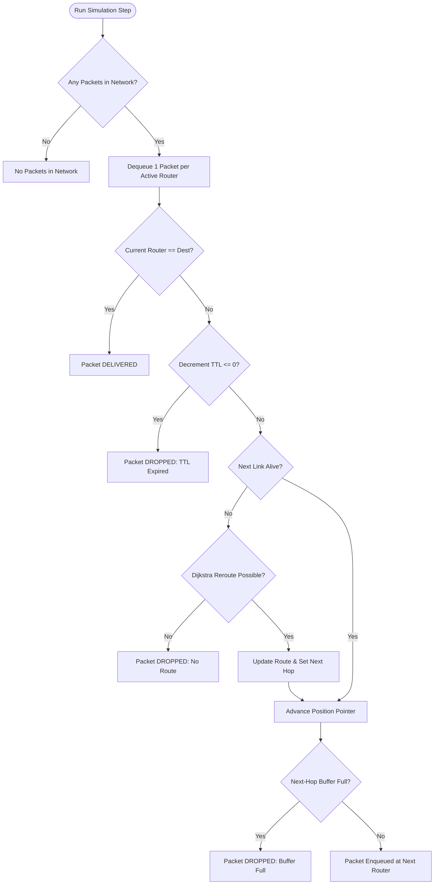

# Network Packet Routing Simulator

[](https://www.oracle.com/java/)
[](https://github.com/jainamehta2007-cpu/PacketRoutingSimulator)
[](https://github.com/jainamehta2007-cpu/PacketRoutingSimulator)
[](https://github.com/jainamehta2007-cpu/PacketRoutingSimulator)

A lightweight, console-driven **Network Packet Routing and Buffering Simulator** implemented in pure Java. This project models a packet-switched communication network as a weighted undirected graph and simulates packet transmission hop-by-hop through bounded router queues. 

Crucially, **no standard `java.util` collection libraries** (such as `ArrayList`, `LinkedList`, or `PriorityQueue`) are used. All primary data structures—including the graph adjacency list, bounded FIFO packet buffers, and the binary min-heap for Dijkstra's shortest-path algorithm—are implemented **from scratch** to demonstrate foundational computer science algorithms and memory structures.

---

## Table of Contents
- [Problem Statement & Objectives](#problem-statement--objectives)
- [System Architecture](#system-architecture)
- [Network Topology & Algorithms](#network-topology--algorithms)
- [Data Structures & Design Justifications](#data-structures--design-justifications)
- [Simulation Lifecycle & Fault Tolerance](#simulation-lifecycle--fault-tolerance)
- [Complexity Analysis](#complexity-analysis)
- [Project Structure](#project-structure)
- [Test Cases & Results](#test-cases--results)
- [Compilation & Execution](#compilation--execution)
- [Future Scope & Enhancements](#future-scope--enhancements)
- [References](#references)

---

## Problem Statement & Objectives

### The Problem
Physical computer networks cannot be safely experimented on to observe routing edge cases, packet queuing delays, buffer overflows, or dynamic link cuts without disrupting real traffic. Commercial network simulators are heavy, closed-source, and abstract away the underlying data structures.

### Objectives
1. **Custom Graph Representation:** Model a network of routers and weighted physical links as a sparse graph using a singly linked adjacency list ($O(V+E)$ space).
2. **Custom Bounded FIFO Queue:** Model hardware router buffers with a fixed capacity (default: 3 packets) using a custom singly linked FIFO queue ($O(1)$ operations).
3. **Multi-Algorithm Path Finding:**
   - **Breadth-First Search (BFS):** Fewest-hops path ($O(V+E)$).
   - **Dijkstra's Algorithm:** Least-delay / least-cost path using a custom array-backed binary min-heap ($O((V+E)\log V)$).
   - **Depth-First Search (DFS):** Enumeration of all loop-free simple paths via backtracking ($O(V!)$ worst-case).
4. **Dynamic Simulation & Fault Tolerance:**
   - Per-tick, hop-by-hop forwarding of packets across router queues.
   - Dynamic link failure simulation triggering automatic on-the-fly rerouting.
   - Packet dropping upon router buffer exhaustion or Time-To-Live (TTL) expiration.
5. **Strict Constraint:** Zero dependence on pre-packaged Java collections for algorithm data structures.

---

## System Architecture

The simulator maintains a strict separation of concerns between user interaction, network topology management, and fundamental data structures.



### Data Flow Diagram (Level 0 DFD)



---

## Network Topology & Algorithms

The simulator includes a pre-loaded sample topology (`loadSample()`) representing an asymmetric, weighted network of 5 routers:

```
        (4)
    [A]------[B]
     |        |
 (2) |        | (5)
     |        |
    [C]------[D]
     |   (8)  |
 (3) |        | (1)
     +---[E]--+
```

### Link Cost Matrix (Sample Network)
| From | To | Weight (Delay) |
| :---: | :---: | :---: |
| **A** | **B** | 4 |
| **A** | **C** | 2 |
| **B** | **D** | 5 |
| **C** | **D** | 8 |
| **C** | **E** | 3 |
| **E** | **D** | 1 |

### Algorithm Trade-off: Fewest Hops vs. Least Delay
When routing a packet from **A to D**:
- **BFS (Fewest Hops):** Selects `A -> C -> D`
  - **Hops:** 2 hops
  - **Total Latency / Cost:** $2 + 8 = \mathbf{10}$
- **Dijkstra (Least Delay):** Selects `A -> C -> E -> D`
  - **Hops:** 3 hops
  - **Total Latency / Cost:** $2 + 3 + 1 = \mathbf{6}$

> **Insight:** Shortest path in terms of hop count does **not** equal least cost in real weighted communication networks. Dijkstra optimizes for propagation latency, while BFS minimizes hop-by-hop store-and-forward latency.

---

## Data Structures & Design Justifications

```
+--------------------------------------------------------------------------+
|                        DATA STRUCTURE MATRIX                             |
+----------------------+--------------------+------------------------------+
| Component            | Implementation     | Primary Justification        |
+----------------------+--------------------+------------------------------+
| Network Graph        | Adjacency List     | Sparse network memory O(V+E) |
| Router Packet Buffer | Singly-Linked FIFO | Bounded buffer, O(1) ops     |
| Dijkstra Priority Q  | Binary Min-Heap    | Extract-min in O(log V)      |
| Traversal State      | Flat Arrays        | Direct O(1) index addressing |
| Path Enumeration     | Recursion Stack    | Exhaustive DFS backtracking  |
+----------------------+--------------------+------------------------------+
```

### 1. Network Graph (`Graph.java`, `Router.java`)
- **Structure:** Array of `Router` objects (`MAX = 50`) where each router maintains a linked list of `Link(to, weight, next)` nodes.
- **Justification:** Real networks are sparse ($E \ll V^2$). An adjacency matrix would consume $O(V^2) = 2500$ references regardless of link density. An adjacency list consumes only $O(V + E)$ memory and enables direct iteration over active neighbours.
- **Deletion Strategy:** Routers use logical deletion (`exists = false`) and purge connected links. This preserves fixed vertex indices for active nodes without costly array reshuffling.

### 2. Custom FIFO Queue (`MyQueue<T>.java`)
- **Structure:** Bounded singly-linked list maintaining `front` and `rear` pointers with explicit `capacity` checks.
- **Justification:** Models physical switch/router ingress memory. Both `enqueue()` and `dequeue()` execute in strict **$O(1)$** time without shifting elements (unlike array-based circular queues when resizing). Returns `false` on overflow to trigger deterministic packet drops.

### 3. Custom Binary Min-Heap (`MinHeap.java`)
- **Structure:** Resizing array storing parallel `node[]` and `dist[]` entries with standard complete binary tree heap invariants.
- **Justification:** Linear scans for minimum unvisited distances in Dijkstra take $O(V^2)$ time. The binary min-heap allows `extractMin()` and `insert()` in **$O(\log n)$** time, yielding an overall complexity of **$O((V + E) \log V)$**.
- **Lazy Update Strategy:** Rather than an expensive $O(V)$ decrease-key operation, updated distances are inserted as new elements into the heap, and duplicate entries are skipped using a `done[]` array upon extraction.

### 4. Traversal & Path Arrays
- **Structure:** `dist[]`, `visited[]`, `parent[]`, `path[]`.
- **Justification:** Contiguous arrays indexed by router IDs provide instantaneous $O(1)$ read/write performance during traversals. The path can be reconstructed in $O(V)$ time by walking backwards along `parent[]`.

---

## Simulation Lifecycle & Fault Tolerance

### 1. Ingestion & Transmission Flowchart (`sendPacket`)



### 2. Per-Step Propagation & Rerouting Flowchart (`runStep`)



### Fault Tolerance Capabilities
1. **Dynamic Link Failure Handling:** If a physical link along a packet's pre-computed path is deleted (option 4) while the packet is mid-transit, the current forwarding router intercepts the failure, invokes Dijkstra on-the-fly to find an alternate route to the destination, and resumes transmission.
2. **Buffer Exhaustion Handling:** Routers enforce a hardware buffer limit (default: 3 packets). When traffic bursts exceed capacity, incoming packets are dropped immediately to protect router stability.
3. **Loop Prevention via TTL:** Every packet begins with a Time-To-Live counter (default: 10 hops). Each forwarding hop decrements the TTL; if zero is reached, the packet is discarded to prevent infinite circulating loops.

---

## Complexity Analysis

| Operation | Best Case | Average Case | Worst Case | Auxiliary Space | Explanation |
| :--- | :---: | :---: | :---: | :---: | :--- |
| **Packet Enqueue** | $O(1)$ | $O(1)$ | $O(1)$ | $O(1)$ | Insert at tail of linked queue |
| **Packet Dequeue** | $O(1)$ | $O(1)$ | $O(1)$ | $O(1)$ | Remove node from head of linked queue |
| **Heap Insert** | $O(1)$ | $O(\log n)$ | $O(\log n)$ | $O(1)$ amortized | Bubble-up across tree levels |
| **Heap Extract-Min** | $O(\log n)$ | $O(\log n)$ | $O(\log n)$ | $O(1)$ | Bubble-down across tree levels |
| **Router Lookup (by Name)** | $O(1)$ | $O(V)$ | $O(V)$ | $O(1)$ | Sequential scan across router array |
| **Link Add / Check** | $O(1)$ | $O(d)$ | $O(V)$ | $O(1)$ | Scan adjacency list of degree $d$ |
| **BFS Routing (Fewest Hops)** | $O(1)$ | $O(V + E)$ | $O(V + E)$ | $O(V)$ | Queue-driven graph traversal |
| **Dijkstra Routing (Least Delay)**| $O(V + E)$ | $O((V + E)\log V)$ | $O((V + E)\log V)$ | $O(V + E)$ | Min-heap guided greedy traversal |
| **DFS All-Paths Enumeration** | $O(V + E)$ | Exponential | $O(V!)$ | $O(V)$ | Exhaustive recursive backtracking |
| **Simulation Tick (Single Step)** | $O(V)$ | $O(V)$ | $O(V \cdot (V + E)\log V)$ | $O(1)$ | Dequeues 1 packet; reroutes if link fails |

*Notation: $V$ = number of routers, $E$ = number of links, $d$ = router degree, $n$ = heap size.*

---

## Project Structure

```
PacketRoutingSimulator/
├── PacketRoutingSimulator/
│   ├── Packet.java         # Datagram entity: ID, payload, route array, hop position, TTL
│   ├── Router.java         # Router vertex: name, existence flag, Link list, MyQueue buffer
│   ├── MyQueue.java        # Generic singly-linked bounded FIFO queue (capacity-limited)
│   ├── MinHeap.java        # Custom array-backed binary min-heap for Dijkstra's algorithm
│   ├── Graph.java          # Network graph topology, adjacency lists, BFS, Dijkstra, DFS
│   └── Main.java           # Terminal CLI driver, simulation runner, preloaded topology
└── README.md               # Technical documentation, architecture, and manual
```

---

## Test Cases & Results

The simulator has been evaluated across 12 distinct test cases covering nominal paths, boundary limits, and network anomalies:

| Test ID | Scenario / Input | Expected Behaviour | Actual Behaviour | Result |
| :---: | :--- | :--- | :--- | :---: |
| **TC01** | Route A $\to$ D via Dijkstra (Algo 2) | Finds least delay route: `A -> C -> E -> D` (cost 6) | `Route: A -> C -> E -> D (cost: 6, hops: 3)` | **PASS** |
| **TC02** | Route A $\to$ D via BFS (Algo 1) | Finds fewest hops route: `A -> C -> D` (cost 10) | `Route: A -> C -> D (cost: 10, hops: 2)` | **PASS** |
| **TC03** | Route A $\to$ A (Self loop) | Detects immediate delivery without queueing | `Source and destination are same. Delivered instantly.` | **PASS** |
| **TC04** | Disconnected router (Add X, route A $\to$ X) | Identifies unreachable node gracefully | `Destination unreachable!` | **PASS** |
| **TC05** | All paths A $\to$ D via DFS | Lists all 3 loop-free paths with cumulative costs | 3 paths printed: `A->C->E->D (6)`, `A->C->D (10)`, `A->B->D (9)` | **PASS** |
| **TC06** | Link failure mid-transit (Cut C-E while packet is at C) | Dynamic Dijkstra reroute from C to D | `Packet 1 REROUTED: C -> D` $\to$ Delivered at D | **PASS** |
| **TC07** | Buffer overflow (Send 4 packets into router A) | First 3 packets queue, 4th packet dropped | `Buffer full at source. Packet 4 DROPPED.` | **PASS** |
| **TC08** | Add duplicate router (Add router A) | Duplicate rejected without crashing | `Failed (duplicate/limit).` | **PASS** |
| **TC09** | Invalid router name (Send Z $\to$ D) | Input validation fails cleanly | `Invalid router.` | **PASS** |
| **TC10** | Node failure (Remove router E, route A $\to$ D) | Reroutes around deleted node via `A -> B -> D` | `Route: A -> B -> D (cost: 9, hops: 2)` | **PASS** |
| **TC11** | Duplicate link (Add link A-B) | Duplicate edge creation blocked | `Failed (invalid/duplicate).` | **PASS** |
| **TC12** | Non-existent link deletion (Remove link A-E) | Safe error message returned | `Link not found.` | **PASS** |

---

## Compilation & Execution

### Prerequisites
- **Java Development Kit (JDK):** Version 17, 21, or 25+
- **Terminal:** PowerShell, Command Prompt, or Linux/macOS Bash

### 1. Clone the Repository
```bash
git clone https://github.com/jainamehta2007-cpu/PacketRoutingSimulator.git
cd PacketRoutingSimulator
```

### 2. Compile
Compile all source files from the repository root:
```bash
javac PacketRoutingSimulator/*.java
```

### 3. Run
Launch the simulation driver:
```bash
java PacketRoutingSimulator.Main
```

### 4. Interactive Menu Reference
```
===== Network Packet Routing Simulator =====
1. Add router              2. Remove router
3. Add link                4. Remove link (link failure)
5. Display network         6. Send packet
7. All paths (DFS)         8. Run simulation step
9. Router queue status    10. Load sample network
0. Exit
Choice: 
```

---

## Future Scope & Enhancements

1. **Interactive Graphical User Interface (GUI):** A visual topology canvas using JavaFX or HTML5 Canvas showing live packet animations and link cuts.
2. **Quality of Service (QoS) & Packet Priority:** Replacing each router's single FIFO buffer with a priority queue to forward time-critical packets (e.g., VoIP/video) ahead of best-effort data.
3. **Dynamic Protocol Emulation:** Implementing autonomous distance-vector (RIP / Bellman-Ford) or link-state (OSPF) routing table exchanges rather than centralized calculation.
4. **Topology Persistence:** Serializing and importing complex network topologies via JSON or YAML configuration files.

---

## References

1. **Cormen, T. H., Leiserson, C. E., Rivest, R. L., & Stein, C.** (2009). *Introduction to Algorithms* (3rd ed.). The MIT Press.
2. **Sedgewick, R., & Wayne, K.** (2011). *Algorithms* (4th ed.). Addison-Wesley Professional.
3. **Tanenbaum, A. S., & Wetherall, D. J.** (2011). *Computer Networks* (5th ed.). Prentice Hall.
4. **Oracle Corporation.** *Java Platform Standard Edition Documentation*. [https://docs.oracle.com/en/java/](https://docs.oracle.com/en/java/)


Built by Nahar Maurya , Jainam Mehta , Aaryan Mishra
